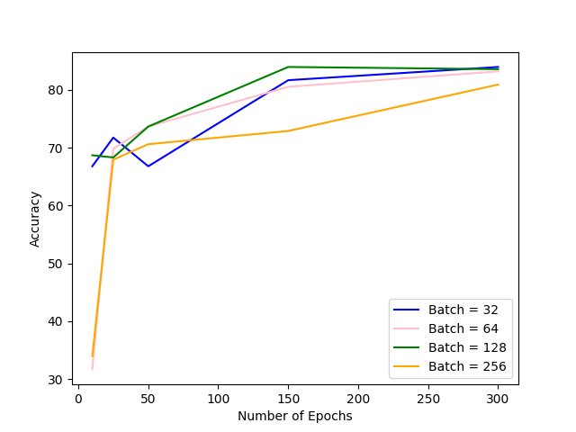

# titanic-survival-prediction-nn
Using passenger list from Titanic, creates model to predict survival using neural networks

## The Dataset

#### The passenger list from the Titanic was downloaded from the link below. This dataset contains the information of 1309 passengers including their glass, age, gender, and whether they survived. 

https://raw.githubusercontent.com/tpradeep8/tableau-data-visualization/master/titanic%20passenger%20list.csv

## Training

#### The following blog was used for reference when creating the model: 
https://machinelearningmastery.com/tutorial-first-neural-network-python-keras/

#### Keras was used to train the model. A Sequential model was created, then layers were added to the model. 
#### The first layer, the input layer, contained 7 neurons as there are 7 features in the data. The output layer contained 1 neuron as there is only 1 output values from the model. Between the input and output layers there is a hidden layer that has 4 neurons. Other resources suggested that the number of neurons in a hidden layer should be the mean of the number of neurons in the input and output layers. 
#### The model was compiled usingthe Adam Optimizer.
#### When the model was fit to the data, a batch size of 10 and epochs of 50 was chosen, which yeilded an accuracy of 78.63%.
## Results
#### After reading other resources regarding choosing values for batch number and epochs, a lot of different website suggested that trial and error is often used for choosing these values. 
#### For batch number, I read suggestions that said that batch number should be power of 2 in order to take full advanges of the GPUs processing power (such as 32 or 64), and somewhere else I read that it should be higher than 40. I decided to try a variety of values and compare the results. I chose to try batch sizes of 32, 64, 128, and 256. I did not try smaller than 32 because I found that the run time was quite long when I decreased the batch size. For epochs, I chose the values of 10, 25, 50, 150 and 300. Below is a table of the results.

#### As you can see above, the accuracy seems to increase with number of epochs, regardless of batch number, and it appears that the smaller the batch number the slightly more accurate the model is. The best results was achieve with a batch number of 32 and 300 epochs with an accuracy of 83.9695%. 